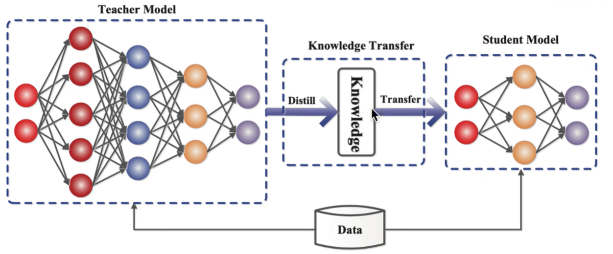

## Algorithm Principles & Overview

实际终端算力有限 + 预训练大模型（参数规模每年增加 10 倍） → 需要模型压缩 + 加速推理 → 知识蒸馏（Knowledge Distillation, KD）

**当前轻量化网络主要方向**：

| 主要方向 | 具体方法/模型/技术 | 关键点/说明 |
| :--- | :--- | :--- |
| **1. 模型压缩** | **知识蒸馏** | 用大型预训练模型（教师模型）指导小型模型（学生模型）的训练，实现知识迁移。 |
| | **权值/网络量化** | 降低权值参数的数值精度（如32位浮点数转为8位整数），减少模型体积和计算量。 |
| | **剪枝** | 移除网络中不重要的连接或节点，包括更细粒度的**通道剪枝**。 |
| | **注意力迁移** | 让学生模型学习教师模型中的注意力图，关注更重要的特征区域。 |
| **2. 设计轻量化网络** | **SqueezeNet, MobileNet (v1/v2/v3), ShuffleNet** | 专门为高效计算设计的经典轻量级网络架构。 |
| | **MnasNet, EfficientNet / EfficientDet** | 通过神经架构搜索或复合缩放方法，在精度和效率间取得更好平衡的网络。 |
| | **Xception** | 采用深度可分离卷积的极端形式，减少计算量。 |
| **3. 加速卷积运算** | **im2col + GEMM** | 将卷积运算转换为通用的矩阵乘法，便于硬件加速。 |
| | **Winograd** | 一种快速算法，能显著减少卷积运算中的乘法次数。 |
| | **低秩分解** | 将大的卷积核分解为多个小卷积核的乘积，降低计算复杂度。 |
| **4. 硬件部署** | **软件框架**：TensorRT, TensorFlow-Slim/Lite, OpenVINO | 专门的推理加速框架，用于模型优化、量化和在不同硬件上的部署。 |
| | **硬件平台**：Jetson, FPGA, 移动端/边缘端/智能终端 | 从NVIDIA的边缘计算设备到可编程逻辑门阵列，以及最终的落地场景。 |
| | **软硬件协同设计** | 针对特定硬件特性设计算法和模型，以最大化性能。 |

